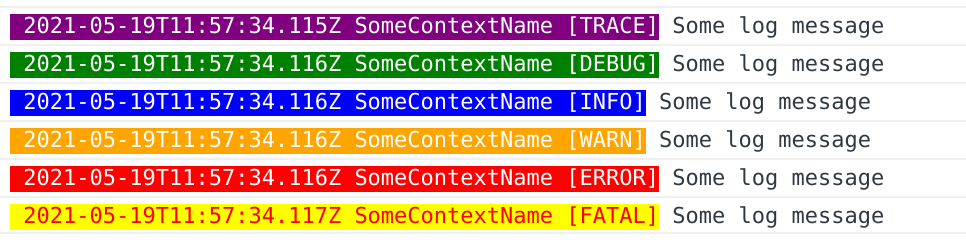

# NgxWlog

NgxWlog (Angular Web Log) is an Angular logger that is inspired by the known [NLog](https://nlog-project.org/) .NET logger.

Main feature are:
* Create named loggers from static method. Logger is not injectable so that 
  you can even use it un static methods or non injected classes.
* Configure multiple loggers with filters and targets
* Manage log levels
* Reconfigure logs at runtime

Angular version is 12.0

# Usage

## Import module

In your `app.module.ts`, import module `NgxWlogModule` and using the `forRoot` method configure your loggers.

Example:
```typescript
@NgModule({
    declarations: [AppComponent, AdminLayoutComponent, SidebarComponent, NavbarComponent],
    imports: [
        ...,
        NgxWlogModule.forRoot({
            targets: [
                {
                    appender: ColoredConsoleAppender,
                    name: 'console'
                }
            ],
            rules: [
                {
                    name: '.*',
                    minLevel: LogLevel.Info,
                    writeTo: 'console'
                }
            ]
        }),
        ...
    ],
    providers: [],
    bootstrap: [AppComponent]
})
export class AppModule {
}
```

## Create loggers

In your code your can create logger everywhere, simply by calling 
```typescript
 LoggerFactory.createLogger('SomeLoggerName')
```

Example:
```typescript
export class MyClass {

    private static log = LoggerFactory.createLogger(MyClass.name);

    static someSataticFunction() {
        MyClass.log.info('Some message');
    }
    
    someClassMethod() {
        const someObject = {};
        MyClass.log.info('Some message', someObject);
    }
}
```

## LoggerFactory

### createLogger method

As said above, `LoggerFactory` provides a method that creates new logger for a specified context
name (a string). The context name will be used to identify witch logger is logging.

```typescript
 LoggerFactory.createLogger('SomeLoggerName')
```

Best practice is to create it in a static property. This to ensure that only one instance
of logger is created by class or file. Also, you can use the class name where the logger
is created (in case of class logger).

```typescript
export class MyClass {

    private static log = LoggerFactory.createLogger(MyClass.name);

}
```

If needed, you can create a logger for usages outside class contexts:

```typescript
/**
 * @file non-class.ts
 */
const log = LoggerFactory.createLogger('non-class.ts');
log.info('Some message');
```

### Runtime configuration change

You can change the NgxWlog configuration at runtime. For that, prepare your 
new configuration and simply call the `LoggerFactory.reload(config: WlogConfig)`
method.

```typescript
const newConfig = {
    ...
} as NgxWlogConfig;
LoggerFactory.reload(newConfig);
```

## Logging

As almost all loggers NgxWlog provides multiple log levels:
* Trace (very verbose)
* Debug
* Info
* Warn
* Error
* Fatal (should not happen)

To log in levels, simply use provided methods:
```typescript
const log = LoggerFactory.createLogger('demo-levels');
log.trace('Some trace message');
log.debug('Some debug message');
log.info('Some info message');
log.warn('Some warn message');
log.error('Some error message');
log.fatal('Some fatal message');
```

You can also specify log level manually:
```typescript
const log = LoggerFactory.createLogger('demo-manual-levels');
log.log(LogLevel.info, 'Some trace message');
```

## Configuration

NgxWlog allow to configure the loggers. This to allow to have multiple loggers with
multiple outputs and filters.

### Targets

The targets configure where the logger will output logs. These are named appenders.

You can configure multiple targets.

Then te targets will be used by rules (see below).

A target expose some properties:

| Property | Description                                                       |
|----------|-------------------------------------------------------------------|
|`name`    | Required.<br>Name of target that identifies it. It will be used into the rules.|
|`appender`| Required.<br>The type of appender that must implements interface `Appender`    |
|`options` | Optional.<br>An object that contains options for appender.<br>This object will be passed to appender constructor.

Example:
```typescript
NgxWlogModule.forRoot({
    targets: [
        {
            appender: ColoredConsoleAppender,
            name: 'console',
            options: {
                traceColor: 'green'
            }
        }
    ],
    ...
})
```

### Rules

The rules define the loggers that will be created and witch target will use the logger.

| Property | Description                                                       |
|----------|-------------------------------------------------------------------|
|`name`    | Required.<br>Regular expression to apply filter on logger context name.<br>Use `'*'` to get all logs (no filter).|
|`minLevel`| Optional.<br>Default: `LogLevel.Trace`<br>The minimal log level to apply. If log level is smaller NgxWlog will not write log.    |
|`maxLevel`| Optional.<br>Default: `LogLevel.Fatal`<br>The maximal log level to apply. If log level is smaller NgxWlog will not write log.    |
|`writeTo` | Required.<br>A list of targets with `,`, `;` or <code>&#124;</code> char separator.
|`active`  | Optional.<br>Default: `true`<br>Specify if logger is active or not. If not, nothing will be logged with this rule.

Example:
```typescript
NgxWlogModule.forRoot({
    ...,
    rules: [
    {  // This rule will log all with level from Info to Error in the console and http target
        name: '.*',
        minLevel: LogLevel.Info,
        maxLevel: LogLevel.Error,
        writeTo: 'console,http',
        active: true
    },
    {  // This rule will log only loggers called 'MyClass' only with level Error in the console target
        name: 'MyClass',
        minLevel: LogLevel.Error,
        maxLevel: LogLevel.Error,
        writeTo: 'http',
        active: true
    }
]})
```
## Appenders

An appender is responsible to append log somewhere. This is the last step of a log.

By default NgxWlog provides by some appenders:
* `ConsoleAppender`
* `ColoredConsoleAppender`

### ConsoleAppender

The `ConsoleAppender` simply log to the browser `console`. If possible, it uses the existing levels
of `console`.
* Trace, Debug and Info logs to `console.log`
* Warning logs to `console.warn`
* Error and Fatal logs to `console.error`

### ColoredConsoleAppender

The `ColoredConsoleAppender` log to the browser `console`, but modify layout with colors.



### Custom appender

You can also implement your own appender. You simply must implement interface
`Appender` and use it in configuration.

By convention, the constructor should receive an `options` parameter that has
the appender configuration options.

```typescript
export class MyAppender implements Appender {

    constructor(private options: any) {
    }

    append(level: LogLevel, data: any): void {
        // Here simply redirect to console, but you can do whatever you want
        console.log(`The level is '${level}'`, ...data);
    }
    
}
```

# TODO

* Implements tests
* Implements HttpClient appender
* Implements layout formatting
* Improve ColoredConsoleAppender to be customizable
* Handle log grouping
